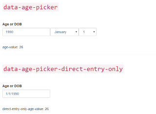

# Age Picker

[](https://www.npmjs.com/package/age-picker)

Enhance `input` tags for collecting age information using `data-` attributes and simple wireup JavaScript.

**[Try out a demo](https://ritterim.github.io/age-picker)!**

## Example



## Installation

```
npm install age-picker
```

Or, load this script manually: [https://unpkg.com/age-picker@latest/lib/age-picker.min.js](https://unpkg.com/age-picker@latest/lib/age-picker.min.js) -- This targets the latest version, which may include breaking changes for major version updates. A specific version can be targeted to avoid potential breaking changes. See [https://unpkg.com](https://unpkg.com) for more information.

## Quickstart

```html
<label for="age">Age or DOB</label>
<input type="text" id="age" name="age" data-age-picker />

<label for="direct-entry-only-age">Age or DOB (direct entry only)</label>
<input type="text" id="direct-entry-only-age" name="direct-entry-only-age" data-age-picker-direct-entry-only />
```

```javascript
new AgePicker().init();
```

## Usage

- Decorate `input` tags with a `data-age-picker` or `data-age-picker-direct-entry-only` attribute.
- Run `new AgePicker().init();`, optionally specifying the scope in the parameter *(defaults to `document.body`)*.

Configuration options can be specified in the `AgePicker` constructor. Example:

```javascript
new AgePicker({
  selectClasses: ['form-control']
}).init();
```

## Configuration options

| Option                         | Description                                                               | Default Value |
| ------------------------------ | ------------------------------------------------------------------------- | ------------- |
| `defaultDomScope`              | The default DOM scope to scan for `dataAttribute` items.                  | `document.body` |
| `dataAttribute`                | The `data-` attribute to scan for.                                        | `'data-age-picker'` |
| `directEntryOnlyDataAttribute` | The `data-` attribute to scan for supporting direct entry only.           | `'data-age-picker-direct-entry-only'` |
| `prefixClass`                  | The prefix for CSS classes used by other configuration CSS classes.       | `'age-picker'` |
| `containerClass`               | The container class surrouding the age picker and all related DOM assets. | ``${this.configuration.prefixClass}-container`` |
| `monthSelectClass`             | The `select` tag to select the month.                                     | ``${this.configuration.prefixClass}-month`` |
| `daySelectClass`               | The `select` tag to select the day.                                       | ``${this.configuration.prefixClass}-day`` |
| `selectClasses`                | An array of custom classes to apply to month and day `select` elements.   | `[]` |
| `i18n`                         | Internationalization data, defaults to US English.                        | `{ months: [...] }` |

## Methods

### `init(domScope = this.configuration.defaultDomScope)`

Scan the `domScope` and wire up any elements matching `this.configuration.dataAttribute`.

### `create(element)`

Create the age picker assets targeting `element`. Used by `init()`.

## Events

**Note:** Events should be used rather than listening for `keyup`, `change`, etc. on the `<input data-age-picker>` tag, since a hidden input becomes the source of truth for the over-the-wire 'age'.

### `ageChanged`

Raised on the `input` element when the age is changed or cleared by any forms of user input (both direct entry and year, month, day inputs). This event includes the age `value`.

## Notes

Our use cases dictate collecting the month and day from the user. However, other or future use cases may allow for using today's date. By using today's date with a provided year age could be calculated. This feature does not currently exist, but was considered.

Currently supports [Gregorian calendar](https://en.wikipedia.org/wiki/Gregorian_calendar) using English language only. Additional languages can be supported by overriding the `i18n` configuration.

## Development

- `npm install`
- `npm run build` or `npm run watch`, then open `demo/index.html` in a browser.
- `npm test` to run tests.
- `npm run lint` to run linter.

## License

MIT
